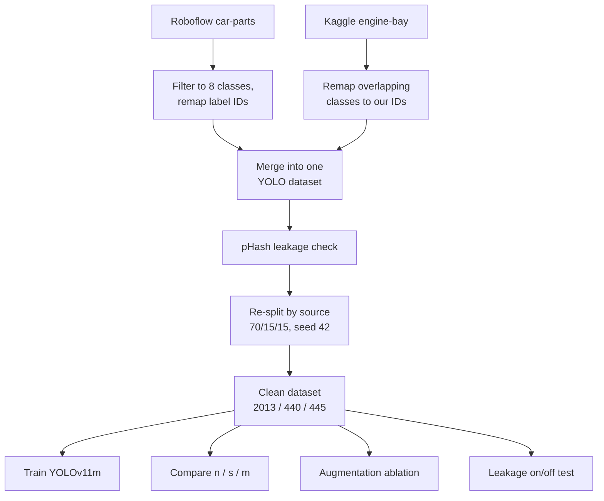

# Engine-Component Detection

This repo holds the code behind my SYNASC paper on detecting engine components from a
single photo. The short version: I built a small object-detection dataset for eight common
under-the-hood parts, trained YOLOv11 on it, and ran a few experiments to figure out what
actually matters when you build a detector on a dataset this size. The notebook reproduces
everything end to end, from assembling the dataset to the final experiments.

The eight parts it recognises are the alternator, battery, radiator, ignition coil, starter,
fuel injector, oil filter and spark plug.

## Why this exists

If you want to detect engine parts, there isn't really a public dataset that fits. Plenty of
car datasets exist, but they're about exteriors, damage, or generic parts, and none of them
match the under-the-hood diagnostic taxonomy I needed. So the dataset had to be assembled
from sources that weren't built for this, and once you do that, the evaluation gets tricky:
merge two image sources carelessly and you end up with near-duplicates straddling the
train/test boundary, which quietly inflates your numbers. A good chunk of this project is
about doing that consolidation honestly and then measuring how much the honesty was worth.

## How the pipeline fits together

## What I found

The deployed model (YOLOv11m) lands at mAP@0.5 = 0.879 on the clean test set. The more
interesting results are the comparisons. Training the nano, small and medium variants under
identical conditions, the small one matches the medium one despite being less than half the
size, so the extra capacity just sits unused: the dataset isn't big enough to need it.

The augmentation ablation says mosaic helps the most, geometric augmentation helps a bit, and
the colour (HSV) jitter does nothing measurable on this data. And the leakage experiment is
the one I care about most: deliberately leaking 40% of the test set into training pushes
mAP@0.5 up by more than five points, none of it real. That's the whole argument for the
per-source de-duplication step.

Per class, the pattern is clean. The small, well-framed parts (spark plug, starter, and
friends) get detected almost perfectly. The big ones that live in a cluttered engine bay,
especially the radiator, are much weaker, and when you look at the confusion matrix the misses
land on the background, not on other parts. So it's not confusing a radiator for a battery;
it's failing to see the radiator at all. The difficulty is the scene, not the part.

## Running it

The notebook is built to be re-runnable. The first thing Part 1 does is look for a prebuilt
`dataset.zip` on your Drive. If it's there, it just unpacks it and you skip straight to the
experiments. If it isn't, the notebook rebuilds the dataset from the two sources and saves a
fresh `dataset.zip` so the next run takes the fast path.

If you're going the fast way, drop `dataset.zip` in your Drive, run Part 0 and the check cell
in Part 1, then carry on from Part 2.

If you want to build it yourself, you'll need a Roboflow API key (set `ROBOFLOW_API_KEY`) and
the Kaggle engine-bay dataset uploaded to Drive with its path in `ENGINE_BAY_DIR`. Run Part 1
top to bottom and it'll download, filter, merge, and zip everything up.

Either way, Parts 2 through 7 are the same: leakage check and re-split, train the main model,
evaluate it, run the variant comparison, run the ablation, and finally the leakage experiment.

## What's in here

The `notebook/` folder has the whole thing in one Colab notebook, organised into the seven
parts above with a short explanation before each step.

The `scraper/` folder is the dataset-building code: `download_baseline.py` pulls the Roboflow
source, `filter_baseline.py` cuts it down to the eight classes and remaps the label IDs,
and `merge_datasets.py` folds in the Kaggle engine-bay images. There's also an optional
Selenium scraper (`orchestrator.py` plus the per-class `scrape_*.py` files) and a cleaning
script that I used to gather extra images during development. That part is optional and not
needed to reproduce the reported dataset, so it's here for completeness rather than as a step
you have to run.

## A note on the data

The two sources (Roboflow and Kaggle) come with their own licenses, so check those before you
redistribute any images. The scraping code is included as code; be careful about what you
actually publish, since scraped product images can carry their own rights.

## Training setup

For the record: YOLOv11m, around 20M parameters, fine-tuned from COCO weights for up to 100
epochs with AdamW, batch 16, image size 640, early stopping with patience 15, fixed seed 42.
Augmentation is mosaic (turned off for the last few epochs), HSV jitter and geometric
transforms. Everything ran on a single NVIDIA L4 in Colab; a full run takes about an hour.

## Citation

If this is useful for your own work, the paper to cite is:

> P.-C. Ochiș and A. Brândușescu, "A Consolidated Eight-Class Engine-Component Detection
> Dataset and an In-Domain YOLOv11 Variant Study for Automotive Diagnostics," SYNASC, 2026.

## License

(Pick one, MIT is the usual choice for the code. Remember the image sources have their own.)
